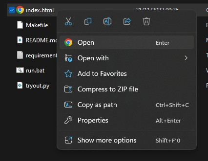

## Installation

---

Install using pip (anaconda prompt)

```shell
pip install -r requirements.txt
```

<br />

## How to Run Server

---

```shell
make run
```

or

```shell
./run.bat
```

<br />

## How to Access

---

Build the model

```shell
curl http://localhost:5000/train
```

Open with Browser


